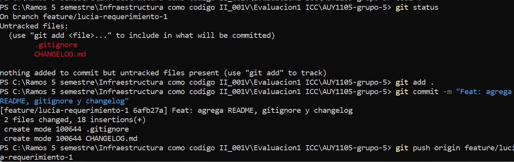
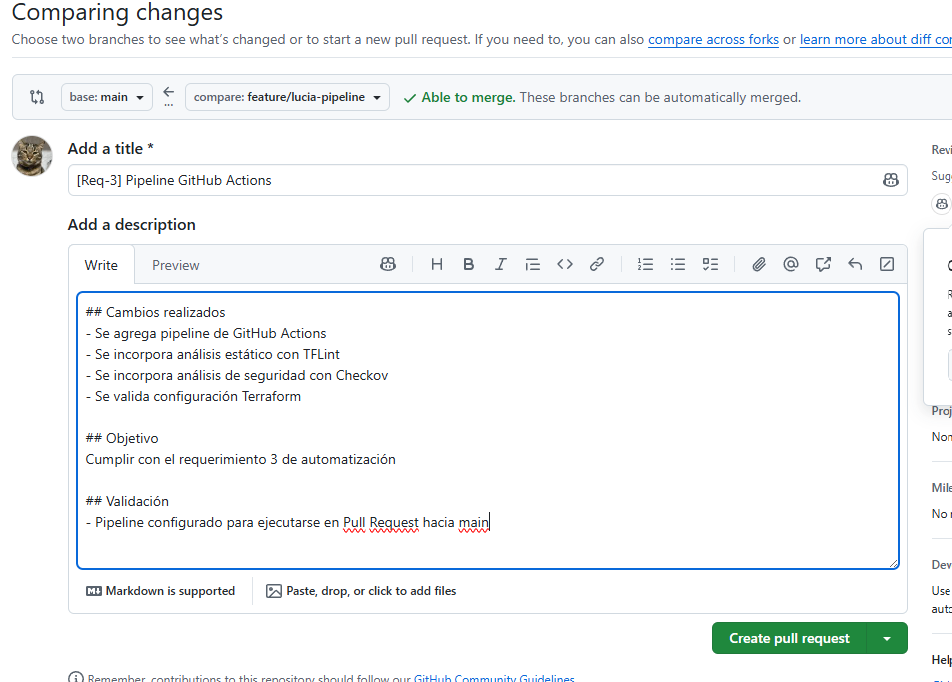
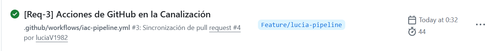
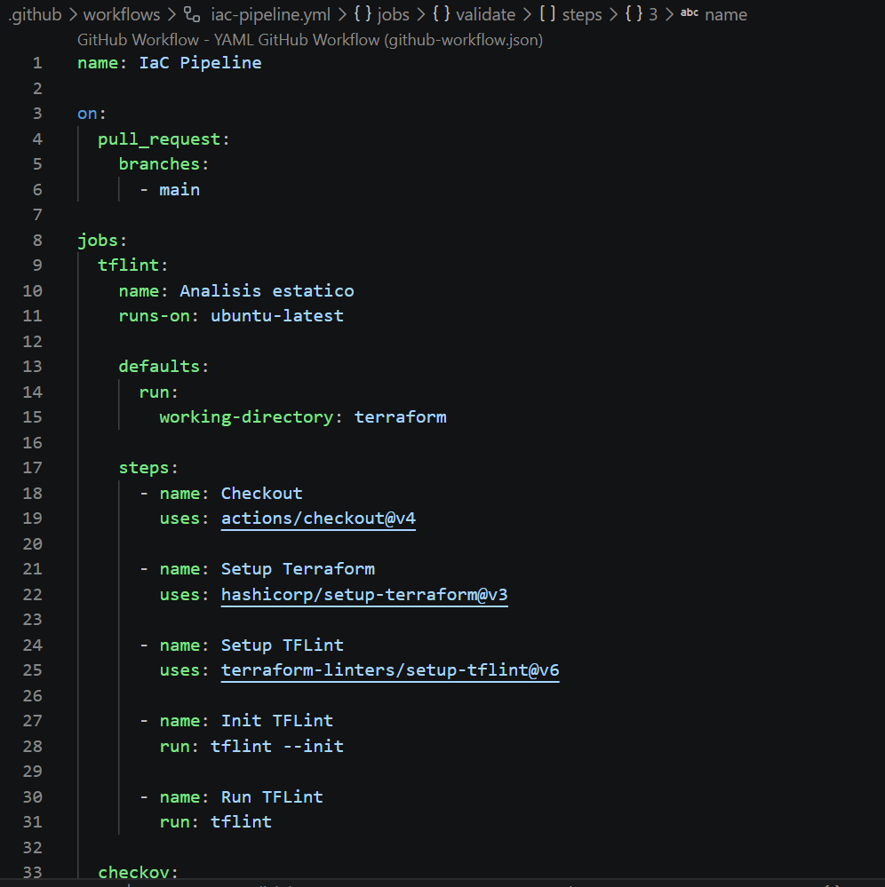
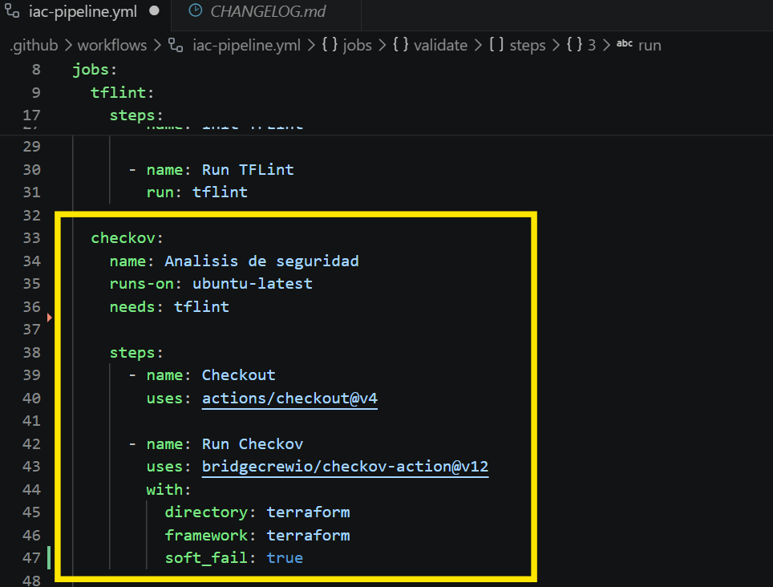
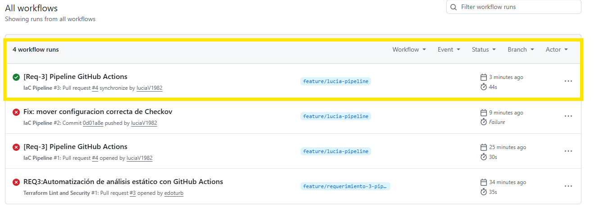
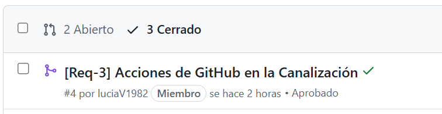

# AUY1105 - Grupo 5

## Evaluación N°1 - Infraestructura como Código II

### Integrantes
- Lucía Villalobos
- Eduardo Urbina

## 🎯 Objetivo

Implementar un flujo automatizado de integración continua (CI) para validar infraestructura como código utilizando Terraform, GitHub Actions y herramientas de análisis de calidad y seguridad.

---

# 📑 Índice

1. Requerimiento 1: Gestión Git y Pull Request  
2. Requerimiento 2: Análisis estático con Terraform  
3. Requerimiento 3: Pipeline con GitHub Actions  
4. Requerimiento 4: Políticas de Seguridad y Costes con OPA  
5. Problemas detectados y soluciones aplicadas  
6. Conclusión

---

# 1️⃣ Requerimiento 1: Gestión Git y Pull Request

Se trabajó utilizando Git y GitHub mediante ramas colaborativas, commits versionados y Pull Requests para integrar cambios hacia la rama principal (`main`).

## Evidencias

### Cambios iniciales del repositorio

### Creación del Pull Request

### Pull Request aprobado

---

# 2️⃣ Requerimiento 2: Análisis estático con Terraform

Se utilizó Terraform para definir infraestructura como código y TFLint para validar buenas prácticas, estructura y sintaxis del código.

Este análisis permite detectar errores tempranos antes del despliegue.

---

# 3️⃣ Requerimiento 3: Pipeline con GitHub Actions

Se implementó un pipeline CI automatizado en GitHub Actions, activado al crear Pull Request hacia la rama principal.

El flujo ejecuta:

- Análisis estático con **TFLint**
- Análisis de seguridad con **Checkov**
- Validación de Terraform con `terraform validate`

## Evidencias

### Configuración del pipeline YAML

### Configuración de Checkov

### Ejecución exitosa del pipeline

### Pull Request cerrado correctamente

---

# 4️⃣ Requerimiento 4: Políticas de Seguridad y Costes con OPA

Se desarrolló un segundo flujo automatizado incorporando **OPA (Open Policy Agent)** para validar reglas personalizadas sobre Terraform.

OPA permite aplicar políticas corporativas antes de aprobar cambios de infraestructura.

Ejemplo:

- Tipos de instancia permitidos
- Restricciones de costos
- Validaciones de seguridad

## Evidencias (Eduardo)

---

## 5️⃣ Problemas detectados y soluciones aplicadas

| Problema detectado | Solución aplicada |
|---|---|
| Error de indentación YAML | Corrección de estructura del workflow |
| Bloque `with:` mal ubicado | Reubicación correcta dentro del step |
| Pipeline fallando por hallazgos Checkov | Uso de `soft_fail: true` |
| Error de credenciales AWS | Ajuste del flujo para validación sin dependencia externa |
| Conflictos Git entre ramas | Uso de `git pull --rebase` y sincronización |

---

## 6️⃣ Conclusión

La actividad permitió aplicar conceptos reales de DevOps e Infraestructura como Código mediante automatización CI/CD.

Se logró trabajar colaborativamente con ramas Git, Pull Requests y revisión entre integrantes. Además, se integraron herramientas modernas de validación como Terraform, TFLint, Checkov y OPA.

El resultado final fue un repositorio funcional con pipelines exitosos, buenas prácticas de versionamiento y controles automáticos de calidad y seguridad.
